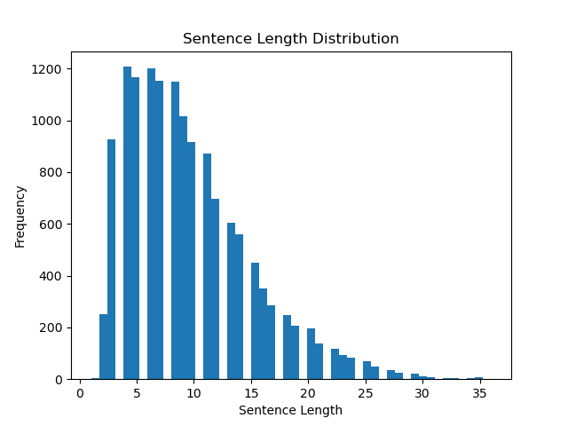

# Text Emotion Classification
This project explores three deep learning approaches for emotion classification in text. We evaluate the performance of a traditional Bag-of-Words model and an advanced LSTM-based approach. Additionally, we apply transfer learning using DistilBERT to benchmark performance against state-of-the-art models.
Please refer to [`text_classify.ipynb`](./text_classify.ipynb) for the demonstration.

## Data sources
The dataset comes from Praveen's [Emotions dataset for NLP](https://www.kaggle.com/datasets/praveengovi/emotions-dataset-for-nlp) on Kaggle.
The dataset consists of 16,000 training samples, 2,000 validation samples, and 2,000 testing samples, each labeled with one of six emotions.

In addition, a pretrained [GloVe](https://nlp.stanford.edu/projects/glove/) model is used for word-to-vector implementation, and [DistilBERT](https://huggingface.co/docs/transformers/model_doc/distilbert) for transfer learning.

## Methodology
To reduce data imbalance, the 'love' and 'surprise' classes are excluded, resulting in a four-emotion dataset containing 14,124 training samples, 1,741 validation samples, and 1,775 test samples.

Text preprocessing includes punctuation removal, stop-word filtering using the NLTK library, and word stemming, ensuring the input was simplified while preserving key features.

Two methods shown below are developed to train the dataset.

### Bag of words + DNN model
The training corpus is tokenized into 9531 unique tokens (words). Each sample can be represented as a 9531-dimension vector representing the occurrence numbers of tokens. A Deep Neural Network (DNN) is constructed with two Dense layers and one output layer.

### Padding sequences + Word-to-Vector + LSTM model
Instead of bag of words, each sample is now padded into a sequence of tokens with a specific padding length of 13 (third quartile of sentence length distribution).

Each token is represented as a 50-dimension vector, and an embedding matrix in the shape of 9531 x 50 is built.

Each sample is processed through an embedding layer and embedded into an array with the shape (13, 50). It is then passed through a masking layer, two LSTM layers, and an output layer for training. Finally, we tune this model using Hyperband.

### Transfer learning with DistilBERT and torch
The dataset is first processed with the tokenizer from DistilBERT and further used to fine-tune the DistilBERT model. The learning rate is set to 3e-5 initiallyand decays linearly over time, and the dropout is set to 0.3.

## Results

|          | Bag-of-Words + DNN | GloVe + LSTM | DistilBERT |
|----------|--------------------|--------------|------------|
| Accuracy | **0.89**           | 0.82         | 0.86       |

For the bag of words method, we obtain 0.89 accuracy. The accuracy is fairly good, but one of the disadvantages is obvious that it requires too many spaces and is too sparse.

For the padding sequence method with pretrained GloVe word-to-vector model, our model achieves 0.82 accuracy. The input size of each training data is 13 x 50 = 650. Although the accuracy is not better than one from the bag of words method, it requires much less space.

For the transfer learning method with DistilBERT model, it achieves 0.86 accuracy. However, it comes with significant memory and computational demands, making it less suitable for resource-constrained environments compared to lighter models like Bag-of-Words.
As a result, we use DistilBERT over the original BERT.

## Modules used
* `pandas`: Constructs a datatable to organize and manipulate all data.
* `sklearn`: Uses LabelEncoder to encode emotions to numbers.
* `nltk`: NLP package for removing stop words and stemming.
* `tensorflow.keras`: Tokenizes words, pads sentences into sequences, and constructs DNN and LSTM models.
* `keras_tuner`: Tunes hyperparameters.
* `torch`: Fine-tunes the DistilBERT model for transfer learning.

## Programs included
* [`text_classify.ipynb`](./text_classify.ipynb):
    * [`text_preprocess.py`](text_preprocess.py): Preprocesses texts by removing stop words and stemming and constructs embedding matrix from word-to-vector models. Constructs a customized dataset for torch training.
    * [`nlp_model.py`](nlp_model.py): Constructs DNN models, LSTM models, and hyperparameter tuning LSTM models. Contains functions for fine-tuning and evaluation with torch.
